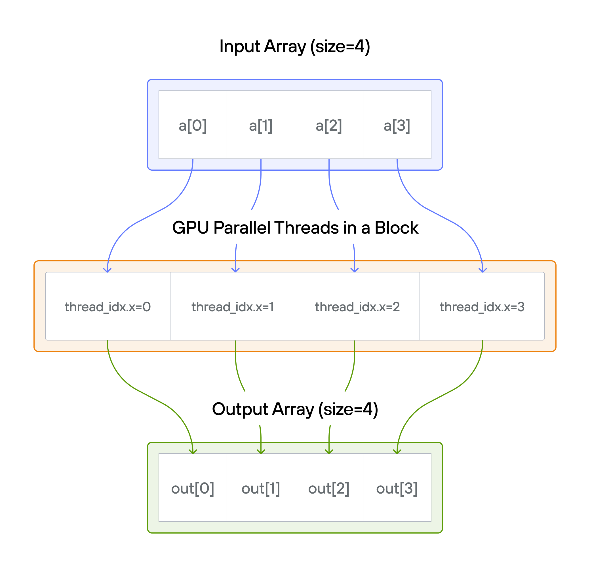
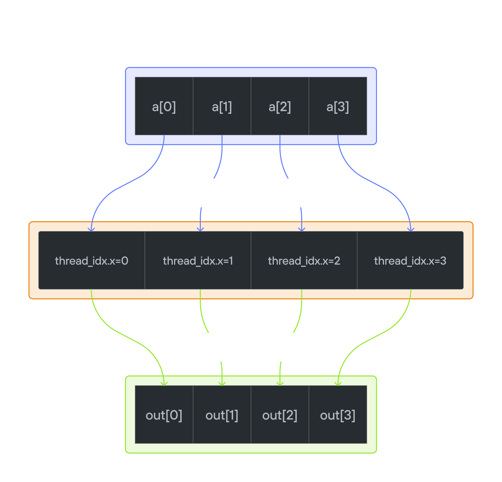

# Puzzle 1: Map

## Overview

This puzzle introduces the fundamental concept of GPU parallelism: mapping individual threads to data elements for concurrent processing.
Your task is to implement a kernel that adds 10 to each element of vector `a`, storing the results in vector `output`.

**Note:** _You have 1 thread per position._

## Key concepts

- Basic GPU kernel structure
- One-to-one thread to data mapping
- Memory access patterns
- Array operations on GPU

For each position \\(i\\):
\\[\Large output[i] = a[i] + 10\\]

## What we cover

### [🔰 Raw Memory Approach](./raw.md)

Start with direct memory manipulation to understand GPU fundamentals.

### [💡 Preview: Modern Approach with LayoutTensor](./layout_tensor_preview.md)

See how LayoutTensor simplifies GPU programming with safer, cleaner code.

💡 **Tip**: Understanding both approaches leads to better appreciation of modern GPU programming patterns.
