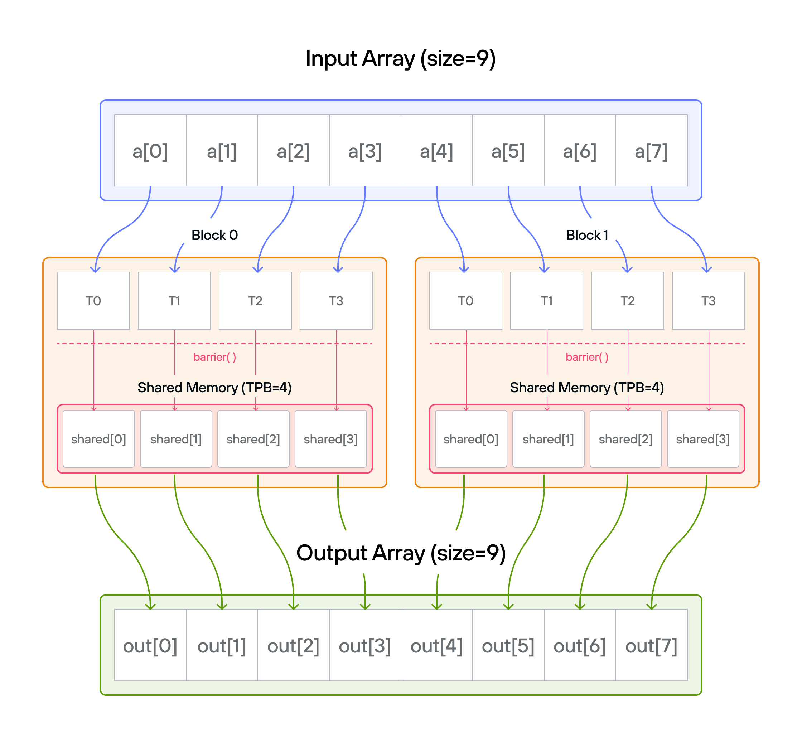
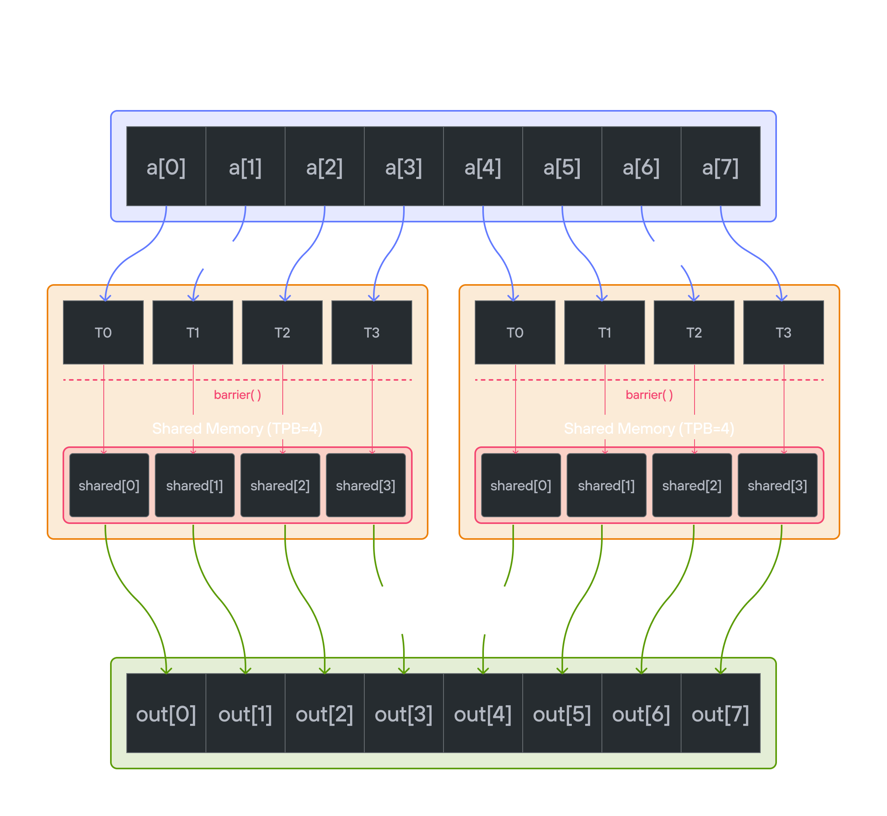

# Puzzle 8: Shared Memory

## Overview

Implement a kernel that adds 10 to each position of a vector `a` and stores it in vector `output`.

**Note:** _You have fewer threads per block than the size of `a`._

## Implementation approaches

### [🔰 Raw memory approach](./raw.md)
Learn how to manually manage shared memory and synchronization.

### [📐 LayoutTensor Version](./layout_tensor.md)
Use LayoutTensor's built-in shared memory management features.

💡 **Note**: Experience how LayoutTensor simplifies shared memory operations while maintaining performance.
